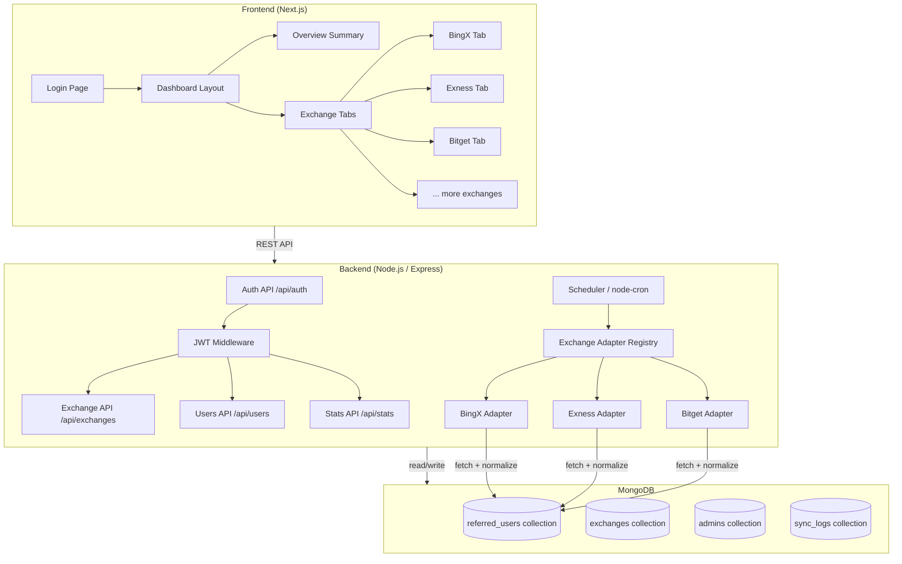

# Design: Referral Dashboard

## System Architecture



## Data Model

### `referred_users` Collection (Unified Schema)
```json
{
  "_id": "ObjectId",
  "exchangeId": "bingx",
  "userId": "external-user-id",
  "username": "string",
  "email": "string (optional)",
  "registeredAt": "ISODate",
  "totalDeposit": 1234.56,
  "totalVolume": 99000.00,
  "totalCommission": 45.67,
  "status": "active | inactive",
  "lastSyncedAt": "ISODate",
  "rawData": {}
}
```

### `exchanges` Collection
```json
{
  "_id": "ObjectId",
  "id": "bingx",
  "name": "BingX",
  "logoUrl": "string",
  "enabled": true,
  "cronSchedule": "0 * * * *",
  "config": { "apiKey": "...", "apiSecret": "..." }
}
```

### `admins` Collection
```json
{
  "_id": "ObjectId",
  "username": "string",
  "passwordHash": "bcrypt hash",
  "createdAt": "ISODate"
}
```

### `sync_logs` Collection
```json
{
  "_id": "ObjectId",
  "exchangeId": "bingx",
  "startedAt": "ISODate",
  "finishedAt": "ISODate",
  "status": "success | failed",
  "recordsUpserted": 100,
  "error": "string (optional)"
}
```

## Exchange Adapter Interface
```typescript
interface ExchangeAdapter {
  exchangeId: string;
  fetchReferrals(): Promise<NormalizedUser[]>;
}

interface NormalizedUser {
  userId: string;
  username: string;
  email?: string;
  registeredAt: Date;
  totalDeposit: number;
  totalVolume: number;
  totalCommission: number;
  status: 'active' | 'inactive';
  rawData?: Record<string, unknown>;
}
```

## API Endpoints

| Method | Path | Description |
|--------|------|-------------|
| POST | `/api/auth/login` | Login, returns JWT |
| GET | `/api/auth/me` | Get current admin |
| GET | `/api/exchanges` | List all enabled exchanges |
| GET | `/api/users?exchange=bingx&page=1&limit=20&search=&from=&to=` | Paginated referred users |
| GET | `/api/stats/overview` | Totals across all exchanges |
| GET | `/api/stats/:exchangeId` | Totals for one exchange |
| GET | `/api/stats/:exchangeId/timeseries?metric=deposit&period=day` | Time-series data |
| GET | `/api/sync-logs?exchange=bingx` | Recent sync logs |
| POST | `/api/sync/:exchangeId` | Trigger manual sync |

## Frontend Routes

| Route | Description |
|-------|-------------|
| `/login` | Login page |
| `/` | Redirects to `/dashboard` |
| `/dashboard` | Overview + exchange tabs |
| `/dashboard/[exchangeId]` | Per-exchange detail tab |

## Technology Stack

| Layer | Technology |
|-------|-----------|
| Frontend | Next.js 14 (App Router), Tailwind CSS, shadcn/ui, Recharts |
| Backend | Python 3.12, FastAPI, Uvicorn |
| ORM/ODM | Beanie (async MongoDB ODM, built on Motor) |
| Database | MongoDB |
| Auth | PyJWT + passlib[bcrypt] |
| Scheduler | APScheduler (AsyncIOScheduler + CronTrigger) |
| HTTP Client | httpx (async) |
| Config | pydantic-settings + .env |
| Containerization | Docker + docker-compose |
